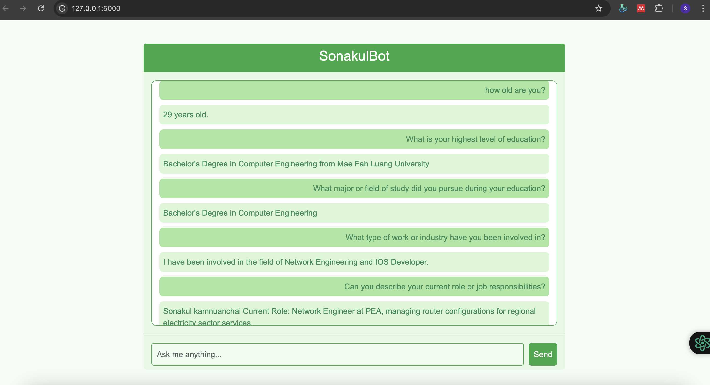

# A6-Lets-Talk-with-Yourself
## st124738
## Sonakul kamnuanchai

## 1. Personal Dataset:
My sample resume (personal_info_sonakul.pdf) contain data in my personal information which are:
- Basic Information
- Research Interests
- Core Beliefs about Technology

## 2. Promt template
Hey there! I'm SonakulBot, your super friendly and cute chatbot!  
If you're curious about anything related to me, feel free to ask!  
Whether it's about my age, my education, my work experience, or anything else, I'm here to share!  
I'll do my best to give you the most accurate and fun answers!  
Can't wait to chat with you!  

{context}  
Question: {question}  
Answer:

## 3. Text-generation models
- T5 from hugging face : lmsys/fastchat-t5-3b-v1.0

## 4. Analysis and Problem Solving
### List of the retriever and generator models :
- Retriever Model used: FAISS
FAISS retrieves the most similar documents from a predefined set of documents using vector similarity. It performs document retrieval by searching for the closest vectors to the query vector.

- Generator Model used : lmsys/fastchat-t5-3b-v1.0
T5 generates an answer based on a given prompt (or query). It can generate fluent, coherent responses even when the exact answer may not be directly available in the data.

### Analyze any issues related to the models providing unrelated information:
- Retriever Model (FAISS): The FAISS retriever is highly efficient at retrieving documents that are similar to the query. However, there are a few limitations:
    - Dependence on Document Quality: If the documents in the database are not well-structured or do not contain sufficient information to answer the query, FAISS might return irrelevant results. For example, if the vector embeddings are not well-optimized or the documents are too generic, FAISS might return documents that are not directly related to the query.
    - Example of Unrelated Information: If you ask the retriever "What is your highest level of education?" and the relevant document does not contain educational information, the retriever may return unrelated documents, such as research interests or unrelated background information, if those parts are indexed.

- Generator Model (T5) : The T5 generator generates answers based on its training data and the given prompt, but it has its own set of potential issues when it comes to providing irrelevant information:
    - Lack of Factual Accuracy: Unlike FAISS, T5 doesn't retrieve information from documents directly. It generates an answer based on its pre-trained knowledge and the given input. This means that T5 may produce an answer that isn't grounded in the current context or specific data.
    - Example of Unrelated Information: If you ask "What is your highest level of education?" and the information is not specifically provided to T5 during training, it could generate a vague or off-topic answer like "I have completed multiple degrees" without providing the details from your personal data.

### 5. How to solve it:
- RAG Approach: Combines both models to retrieve relevant documents and generate contextually accurate responses. Fine-tuning both the retriever (FAISS) and the generator (T5) on domain-specific data can drastically improve the relevance and accuracy of the answers.
- The question-answer pairs has stored in questions_answers.json

## 6. How to run the application:
python app.py

## 7. Output sample in web application
